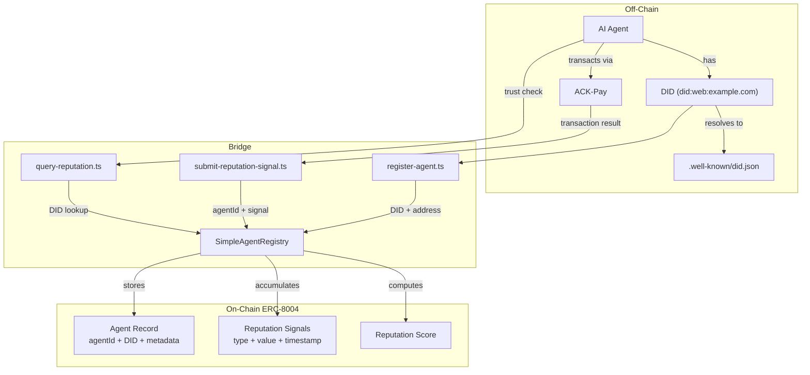
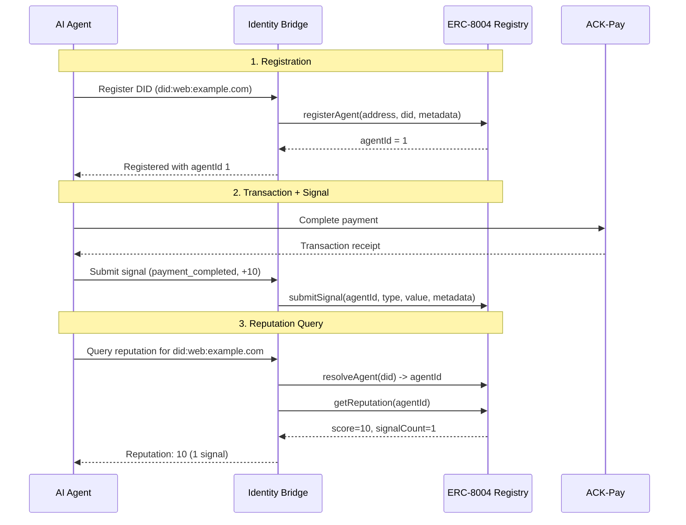

# ACK-ERC8004 Identity Bridge

**Bridge between ACK-ID (off-chain DID identity) and ERC-8004 (on-chain agent reputation registry)**

## The Gap

Two emerging standards are shaping agent-to-agent commerce:

- **ACK-ID** gives AI agents a decentralized identity (DID) using `did:web` — but this identity lives off-chain with no reputation history.
- **ERC-8004** provides an on-chain registry where agents accumulate reputation signals — but it has no native way to link to off-chain DIDs.

**Without a bridge, there is no way for an agent to prove that the DID it presents maps to a verified on-chain reputation, or for on-chain reputation to be tied back to a resolvable identity.**

This project provides that bridge:

1. An agent registers its DID on the ERC-8004 registry, creating a permanent DID-to-agentId mapping.
2. After ACK-Pay transactions complete, reputation signals are submitted on-chain against that agentId.
3. Any agent can resolve a DID to an on-chain reputation score before deciding to transact.

## Architecture



## How It Works



## Install

```bash
# Clone the repo
git clone https://github.com/anthropic/ack-erc8004-identity-bridge.git
cd ack-erc8004-identity-bridge

# Install dependencies
npm install

# Copy environment config
cp .env.example .env
```

## Run on Local Hardhat Network

```bash
# Terminal 1: Start local Hardhat node
npx hardhat node

# Terminal 2: Run the full demo
npx hardhat run src/demo.ts --network localhost
```

The demo will:
1. Deploy the SimpleAgentRegistry contract
2. Register an agent with a `did:web` identity
3. Simulate an ACK-Pay transaction and submit a reputation signal
4. Query the agent's reputation by DID
5. Print the full lifecycle output

## Run Individual Scripts

```bash
# Register an agent
npx hardhat run src/register-agent.ts --network localhost

# Submit a reputation signal
npx hardhat run src/submit-reputation-signal.ts --network localhost

# Query reputation by DID
npx hardhat run src/query-reputation.ts --network localhost
```

## Run Tests

```bash
npx hardhat test
```

## Project Structure

```
contracts/
  IAgentRegistry.sol        # ERC-8004 interface
  SimpleAgentRegistry.sol    # Minimal implementation (demo)
src/
  register-agent.ts          # Register DID on-chain
  submit-reputation-signal.ts # Submit reputation signals
  query-reputation.ts        # Query reputation by DID
  demo.ts                    # Full lifecycle demo
  did-resolver.ts            # did:web resolver (mock for demo)
test/
  SimpleAgentRegistry.test.ts # Contract tests
```

## Reputation Model

The reputation calculation in this demo is **intentionally simple**: it sums all signal values. Production implementations should use application-specific reputation algorithms. This demo uses simple summation for clarity.

Signal types used in the demo:
- `payment_completed` — ACK-Pay transaction completed successfully
- `receipt_verified` — Payment receipt was verified
- `dispute_filed` — A dispute was filed (negative signal)

---

## Author

**Sebastian Borjas** — Founder & CEO, [Lucilla Inc.](https://lucilla.app)

Pioneering **pay-per-visit advertising on-chain** — the first platform where businesses pay USDC rewards only when customers physically show up, verified by wearable sensors and GPS, settled transparently on-chain. No impressions, no clicks, no fraud. Real foot traffic, real payments, real proof.

Lucilla combines Circle Programmable Wallets, USDC on Base/Arc, ERC-8004 agent reputation, and W3C Verifiable Credentials to build the trust infrastructure for location-verified agentic commerce.

- Website: [lucilla.app](https://lucilla.app)
- Email: [s.borjas@lucilla.ca](mailto:s.borjas@lucilla.ca)
- X: [@sb_lucilla](https://x.com/sb_lucilla)
- GitHub: [@superbigroach](https://github.com/superbigroach)

## License

MIT
